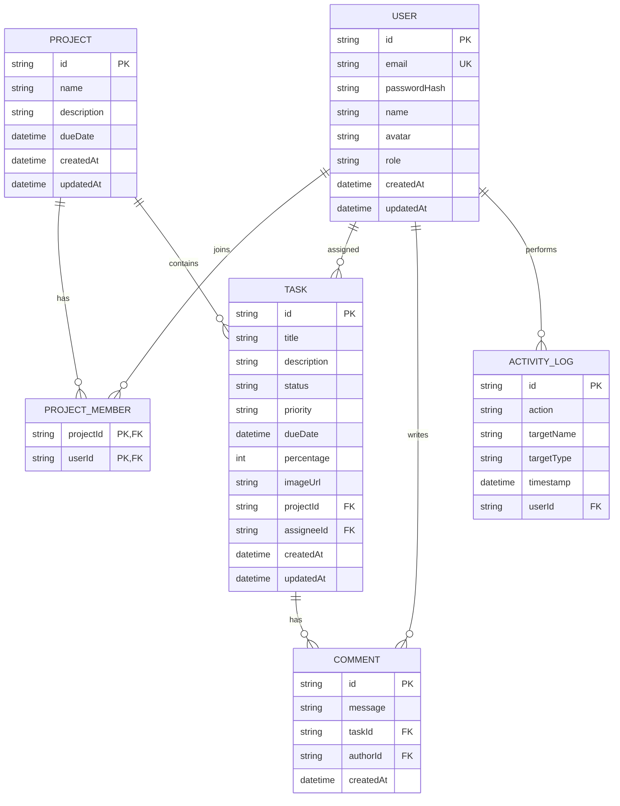

# TaskFlow — Modern Task & Project Management App

TaskFlow is a premium, real-time collaboration and project management application built using a modern React frontend and a Node.js/Express backend, backed by SQLite via Prisma ORM.

---

## 🚀 Key Features

* **Project & Task Boards**: Seamless project creation, task management, prioritization, status progression, and team member assignment.
* **Team Activity Logs**: Automatic tracking and logging of tasks created, moved, updated, or deleted.
* **Persistent SQLite Database**: Dynamic, robust database storage using Prisma client.
* **Advanced Security Suite**:
  * **HTTP Security Headers**: Powered by `helmet` to protect against common web vulnerabilities.
  * **CORS Protection**: Access limited to local frontend host for secure API consumption.
  * **IP Rate Limiting**: Dedicated rate-limiters for general API requests (`apiLimiter`) and strict limiters for authentication endpoints (`authLimiter`) to prevent brute-force attacks.
  * **Input Validation & Sanitization**: Strict email pattern verification and password constraints on registration and update routines.
* **User Authentication**: Secure credentials-based authentication with `bcrypt` password hashing and JWT token authorization.

---

## 🛠️ Project Structure

```text
newtaskapp/
├── backend/                  # Express + Prisma Node.js backend
│   ├── prisma/               # SQLite schema definition & migrations
│   │   ├── dev.db            # SQLite database file
│   │   └── schema.prisma     # Prisma database schema
│   ├── src/
│   │   ├── controllers/      # Route request/response handlers
│   │   ├── middlewares/      # Auth, rate-limiter, and secure headers middlewares
│   │   ├── routes/           # Express router namespaces
│   │   ├── utils/            # JWT helper and common utilities
│   │   └── index.ts          # Server entry point
│   └── package.json          # Backend dependencies
│
├── src/                      # Vite + React frontend client
│   ├── components/           # Reusable UI views (Modals, Task Cards, Boards)
│   ├── context/              # AppContext state manager & API client integration
│   ├── pages/                # Main views (Dashboard, Login, User Progress)
│   └── main.tsx              # React mounting root
│
└── package.json              # Frontend configurations & package manager
```

---

## 📊 Entity-Relationship (ER) Diagram



---

## 📖 Data Dictionary

### 1. `User` Table
Stores registered member details and credentials.

| Field Name | Data Type | Constraint | Description |
| :--- | :--- | :--- | :--- |
| `id` | String | PK, Default: UUID | Unique identifier of the user. |
| `email` | String | Unique | User's email address (login credential). |
| `passwordHash` | String | - | Bcrypt hashed login password. |
| `name` | String | - | First & Last name of the user. |
| `avatar` | String | - | Colored initials of the user or a URL path to the profile image. |
| `role` | String | - | Member role (e.g. "Project Manager", "Developer", "Designer"). |
| `createdAt` | DateTime | Default: `now()` | The date/time user profile was created. |
| `updatedAt` | DateTime | Auto-update | The date/time user profile was last updated. |

### 2. `Project` Table
Stores workspace project definitions.

| Field Name | Data Type | Constraint | Description |
| :--- | :--- | :--- | :--- |
| `id` | String | PK, Default: UUID | Unique identifier of the project. |
| `name` | String | - | Name of the project. |
| `description` | String | Nullable | Optional text description detailing the project. |
| `dueDate` | DateTime | - | Date when project is scheduled for completion. |
| `createdAt` | DateTime | Default: `now()` | The date/time project record was created. |
| `updatedAt` | DateTime | Auto-update | The date/time project record was last updated. |

### 3. `ProjectMember` Table
Bridge entity representing many-to-many relationship of Users assigned to Projects.

| Field Name | Data Type | Constraint | Description |
| :--- | :--- | :--- | :--- |
| `projectId` | String | PK, FK (Project) | Identifier of the project. Cascades on project delete. |
| `userId` | String | PK, FK (User) | Identifier of the user. Cascades on user delete. |

### 4. `Task` Table
Stores actionable items under projects.

| Field Name | Data Type | Constraint | Description |
| :--- | :--- | :--- | :--- |
| `id` | String | PK, Default: UUID | Unique identifier of the task. |
| `title` | String | - | Title of the task. |
| `description` | String | Nullable | Detail description of task deliverables. |
| `status` | String | - | Status ("Backlog", "To Do", "In Progress", "Review", "Done"). |
| `priority` | String | - | Severity priority levels ("Low", "Medium", "High"). |
| `dueDate` | DateTime | - | Due target completion date for the task. |
| `percentage` | Int | Default: 0 | Work completion percentage (range: 0 to 100). |
| `imageUrl` | String | Nullable | Optional file/attachment base64 string or image link. |
| `projectId` | String | FK (Project) | Related project ID. Cascades on project delete. |
| `assigneeId` | String | FK (User) | Member assigned to complete this task. Restricted delete. |
| `createdAt` | DateTime | Default: `now()` | The date/time task was created. |
| `updatedAt` | DateTime | Auto-update | The date/time task was last updated. |

### 5. `Comment` Table
Stores discussion and comment logs on tasks.

| Field Name | Data Type | Constraint | Description |
| :--- | :--- | :--- | :--- |
| `id` | String | PK, Default: UUID | Unique identifier of the comment. |
| `message` | String | - | Raw text comment content. |
| `taskId` | String | FK (Task) | Target task ID comment is posted on. Cascades on delete. |
| `authorId` | String | FK (User) | ID of the commenting user. Cascades on delete. |
| `createdAt` | DateTime | Default: `now()` | The date/time the comment was posted. |

### 6. `ActivityLog` Table
Audit trail logging key board movements and workflow activity.

| Field Name | Data Type | Constraint | Description |
| :--- | :--- | :--- | :--- |
| `id` | String | PK, Default: UUID | Unique identifier of the activity log item. |
| `action` | String | - | Text describing action taken (e.g. "created task", "moved task to Done"). |
| `targetName` | String | - | The title of the entity changed. |
| `targetType` | String | - | Entity type changed ("task", "project", "comment"). |
| `timestamp` | DateTime | Default: `now()` | Time the activity took place. |
| `userId` | String | FK (User) | ID of the user who performed the action. Cascades on delete. |

---

## 📡 REST API Specifications

The base endpoint for all routes is `http://localhost:5000/api`.

### Authentication Routes (`/auth`)

* **`POST /auth/register`**
  - Registers a new user account.
  - Body: `{ name, email, password, role }`
  - Validations: Email format check, password $\geq$ 6 characters, name $\geq$ 2 characters.
  - Rate Limit: Strict limit of 20 requests per 15 minutes.

* **`POST /auth/login`**
  - Authenticates user credentials.
  - Body: `{ email, password }`
  - Response: `{ user: { id, name, email, avatar, role }, token }`
  - Rate Limit: Strict limit of 20 requests per 15 minutes.

* **`GET /auth/me`**
  - Fetches the active authenticated user profile.
  - Headers: `Authorization: Bearer <token>`

---

### User Routes (`/users`)
All routes require a valid JWT token header.

* **`GET /users`**
  - Fetches list of all users.
* **`POST /users`**
  - Creates a new team member with a placeholder credential.
  - Body: `{ name, role }`
* **`PATCH /users/avatar`**
  - Updates current user's avatar initials.
  - Body: `{ avatar }` (Max 2 characters).
* **`GET /users/progress`**
  - Compiles project completion percentages and metrics per user.
* **`PATCH /users/password`**
  - Changes the user's password.
  - Body: `{ currentPassword, newPassword }`
  - Validations: `newPassword` $\geq$ 6 characters.

---

### Project Routes (`/projects`)
All routes require a valid JWT token header.

* **`GET /projects`**
  - Fetches all projects where user is associated.
* **`POST /projects`**
  - Creates a new project.
  - Body: `{ name, description, dueDate }`
* **`POST /projects/:id/members`**
  - Adds a user to the project member list.
  - Body: `{ userId }`

---

### Task Routes (`/tasks`)
All routes require a valid JWT token header.

* **`GET /tasks`**
  - Fetches tasks (optionally filterable via queries: `projectId`, `assigneeId`, `status`, `priority`).
* **`POST /tasks`**
  - Creates a new task.
  - Body: `{ title, description, projectId, assignee, priority, status, dueDate }`
* **`PATCH /tasks/:id`**
  - Updates task detail parameters.
  - Body: `{ title, description, status, priority, assignee, dueDate, percentage, imageUrl }`
* **`DELETE /tasks/:id`**
  - Removes a task from the system.
* **`PATCH /tasks/:id/move`**
  - Quick-updates status only (used for board drag & drop).
  - Body: `{ status }`

---

## 💻 Setup and Local Running

### Prerequisites
* **Node.js** (v18 or higher recommended)
* **npm** or **yarn**

### Step 1: Install Dependencies
Run in the root folder to install frontend dependencies:
```bash
npm install
```

Run in the `backend` folder to install backend dependencies:
```bash
cd backend
npm install
```

### Step 2: Initialize Database (Backend)
Run these commands inside the `backend` folder to set up your SQLite database and generate the Prisma Client:
```bash
npx prisma generate
npx prisma db push
npm run seed
```

### Step 3: Run the Project
Start the backend server (starts on `http://localhost:5000`):
```bash
cd backend
npm run dev
```

Start the frontend application (starts on `http://localhost:3000`):
```bash
# In the root project directory
npm run dev
```

---

## 🔒 Security Configurations
Security features can be modified via environment variables in `backend/.env`:
* `JWT_SECRET`: Secret key used for signing JWT login tokens.
* `FRONTEND_URL`: URL of the approved frontend client (defaults to `http://localhost:3000`).
* `NODE_ENV`: Set to `production` or `development` to trigger dev CORS bypasses.
